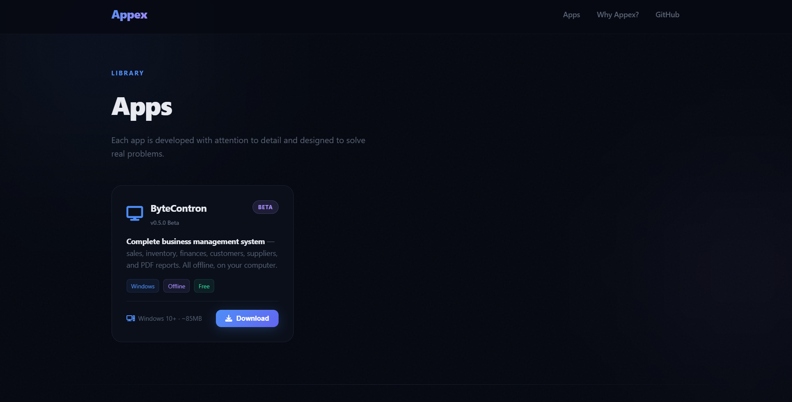
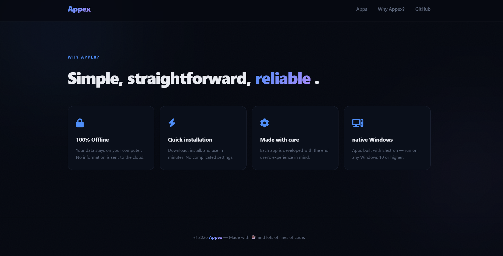

# Appex

A landing page built to launch and distribute my own desktop apps — starting with **ByteContron**, a business management system I developed. Includes a password-gated download flow that validates against a live backend API.

## 🔗 Live Site

👉 [Visit Appex](https://fredson-sy.github.io/Appex/)

## 📸 Screenshot

Appex landing page

  
  

## ✨ Features

- App showcase grid, built to scale as more apps are added
- Password-protected download modal (beta access control)
- Real-time password validation against a backend API
- Show/hide password toggle
- Error shake animation and inline validation feedback
- Fully responsive layout
- Glassmorphism-style UI with animated glow backgrounds

## 🛠️ Tech Stack
APPEX

**Frontend**
- HTML5, CSS3 (custom properties, backdrop-filter, grid/flexbox)
- Vanilla JavaScript (Fetch API, async/await)
- Font Awesome icons

**Backend**
- Node.js API hosted on [Render](https://render.com), handling password verification and returning the download link

## ⚙️ Running Locally

\`\`\`bash
git clone https://github.com/Fredson-Sy/Appex.git
cd Appex
python -m http.server 8080
\`\`\`

Then open `http://localhost:8080` in your browser.
> Note: the download modal requires the backend API to be running/reachable.

## 🧠 What I Learned

- Connecting a static frontend to a live backend API using `fetch` and handling async states (loading, success, error)
- Building accessible modal interactions (focus management, click-outside-to-close, keyboard support)
- Designing a password-gated distribution flow for a beta product

## 📄 License

MIT
